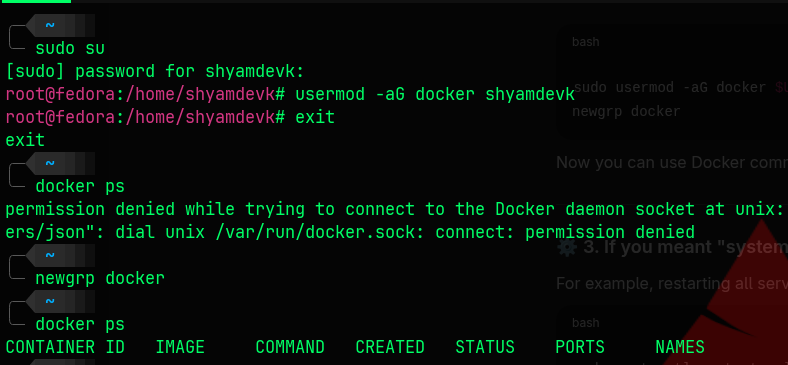

# 🐳 Docker & Containerization — Complete Guide

---

## 🖥️ 1. Virtual Machine (VM)

A **Virtual Machine (VM)** is a software-based computer that runs inside a physical computer.  
It uses a **hypervisor** (like VirtualBox, VMware, or Hyper-V) to share hardware resources such as CPU, RAM, and Disk among multiple VMs.  
Each VM has its own **operating system** and runs applications independently.

### 🔻 Disadvantages of Virtual Machines

- ⚙️ **Heavy resource usage** – Each VM needs a full OS → consumes more CPU, memory, and storage.  
- 🐢 **Slower performance** – Because of the extra OS layer and hypervisor.  
- ⏱️ **Long startup time** – Takes longer to boot compared to containers.  
- 💾 **Less efficient** – Difficult to scale quickly due to size and resource needs.

---

## 📦 2. Container

A **Container** is a lightweight, portable package that contains everything needed to run an application — code, libraries, and dependencies.  
It shares the same OS kernel as the host, so it doesn’t need a full OS like a VM.

### ✅ Advantages of Containers over Virtual Machines

- ⚡ **Lightweight** – Uses less memory and storage.  
- 🚀 **Fast startup** – Containers start in seconds.  
- 🔁 **Portable** – Runs the same on any system (no OS dependency).  
- 📈 **Easy to scale** – Quickly start or stop multiple containers.

---

## 🐳 3. Docker

**Docker** is a popular containerization platform that helps developers build, package, and run applications in containers easily.

### 🔹 In Simple Terms

> **Docker = Tool used to create and manage containers.**

### 🔹 What Docker Provides

- 🧩 **Docker Images** – Blueprints for containers.  
- 📦 **Docker Containers** – Running instances of images.  
- 🔄 **Docker Hub** – Online repository to share and download images.

---

## 🧠 In Short

| Feature | Virtual Machine | Container | Docker |
|----------|----------------|------------|---------|
| **OS** | Each VM has its own OS | Shares host OS | Platform to manage containers |
| **Speed** | Slow to start | Fast to start | Helps create/manage containers |
| **Resource Use** | Heavy | Lightweight | Lightweight (via containers) |
| **Example** | VMware, VirtualBox | Kubernetes, Podman | Docker Engine |

---

## 🐳 Docker Initialization  


# 🐳 Docker Initialization (Non-Root User Setup)

When you install Docker on Linux, it usually requires **sudo** to run Docker commands.  
This setup lets your user run Docker **without using `sudo`** every time.

---

## 🧭 Steps to Enable Docker for a Non-Root User

### 1️⃣ Switch to the Root User
```bash
sudo su
````

Used to switch to the **root account** to perform administrative actions.

---

### 2️⃣ Add Your User to the Docker Group

```bash
usermod -aG docker <username>
```

**Example:**

```bash
usermod -aG docker shyamdevk
```

✅ This adds the user **`shyamdevk`** to the **`docker` group**, giving permission to access the Docker daemon.

---

### 3️⃣ Exit Root Mode

```bash
exit
```

Leaves root mode and returns to your normal user session.

---

### 4️⃣ Test Docker Access

```bash
docker ps
```

❌ If you see:

```
permission denied while trying to connect to the Docker daemon socket
```

it means your group permissions haven’t refreshed yet.

---

### 5️⃣ Refresh Group Membership

```bash
newgrp docker
```

This command refreshes your session with the new group permissions — no need to log out.

---

### 6️⃣ Verify Docker Access

```bash
docker ps
```

✅ Now this should work — listing all running containers without needing `sudo`.

---

## 🧠 Summary

| Command                         | Purpose                   |
| ------------------------------- | ------------------------- |
| `sudo su`                       | Switch to root user       |
| `usermod -aG docker <username>` | Add user to docker group  |
| `exit`                          | Return to normal user     |
| `docker ps`                     | Test Docker access        |
| `newgrp docker`                 | Refresh group permissions |


## 🐳 Docker Architecture  


### 1️⃣ Client
The user interacts with Docker using commands like:
```bash
docker build     # builds a Docker image  
docker pull      # downloads an image from a registry  
docker run       # runs a container using an image
````

These commands are sent to the **Docker Daemon**.

### 2️⃣ Docker Host

The system where Docker actually runs. It contains:

* **Docker Daemon** → builds, runs, and manages containers.
* **Images** → read-only templates used to create containers.
* **Containers** → running instances of Docker images.

### 3️⃣ Registry

A storage place for Docker images (like Docker Hub).

* `docker pull` → downloads images.
* `docker push` → uploads images.

---

## 🏷️ Popular Container Registries

| Registry                                  | Description                                        |
| ----------------------------------------- | -------------------------------------------------- |
| **GHCR (GitHub Container Registry)**      | Store and manage Docker images directly in GitHub. |
| **GitLab Container Registry**             | Integrated with GitLab CI/CD pipelines.            |
| **Quay.io**                               | Red Hat’s secure and reliable registry.            |
| **GCR (Google Container Registry)**       | Google Cloud’s image registry.                     |
| **ECR (Elastic Container Registry)**      | AWS service for image storage.                     |
| **ACR (Azure Container Registry)**        | Microsoft Azure’s registry for private images.     |
| **IBM CR (IBM Cloud Container Registry)** | IBM Cloud’s image storage service.                 |

---

## 🐳 Dockerfile

A **Dockerfile** is a text file containing instructions to build a Docker image.
It defines what goes inside the image — base OS, software, files, and commands.

When you run:

```bash
docker build .
```

Docker reads the Dockerfile and creates an image step-by-step.

---

## 🐳 Docker Image

A **Docker Image** is a read-only template used to create Docker containers.
It includes:

* Operating System
* Application code
* Libraries and dependencies
* Configuration settings

### ⚙️ Key Points

* Images are **immutable**.
* You can pull from registries like Docker Hub:

  ```bash
  docker pull ubuntu
  ```
* Run an image to create a container:

  ```bash
  docker run image_name
  ```
* Images are built in **layers**, improving reusability and speed.

---

## ⚙️ Docker Engine vs Docker Daemon

| Component                   | Description                                                                        |
| --------------------------- | ---------------------------------------------------------------------------------- |
| **Docker Engine**           | The full Docker system that includes the Daemon, CLI, and REST API.                |
| **Docker Daemon (dockerd)** | The background service responsible for building, running, and managing containers. |

🧠 **In short:**

> Docker Engine = Full system
> Docker Daemon = The core process inside it

---

## 🐳 Common Docker Commands

| Command                               | Description                             |
| ------------------------------------- | --------------------------------------- |
| `docker pull <image>`                 | Download an image from registry         |
| `docker images`                       | List all images                         |
| `docker rmi <image>`                  | Remove an image                         |
| `docker run <image>`                  | Create & run a container (foreground)   |
| `docker create <image>`               | Create container without running        |
| `docker run -d <image>`               | Run container in background             |
| `docker run -d --name <name> <image>` | Run with custom name                    |
| `docker ps`                           | List running containers                 |
| `docker ps -a`                        | List all containers (including stopped) |
| `docker stop <container>`             | Stop a running container                |
| `docker start <container>`            | Start a stopped container               |
| `docker rm <container>`               | Remove container                        |
| `docker exec -it <container> bash`    | Access container shell                  |

---

## 🐳 Docker Container Lifecycle

| State       | Description                                        |
| ----------- | -------------------------------------------------- |
| **Created** | Made using `docker create`, but not started yet.   |
| **Running** | Actively executing its process (`docker run`).     |
| **Paused**  | Temporarily stopped processes (`docker pause`).    |
| **Stopped** | Container stopped but data exists (`docker stop`). |
| **Exited**  | Finished running or manually stopped.              |
| **Dead**    | Failed/unresponsive container needing cleanup.     |

🧠 **In short:**

> Created → Running → (Paused / Stopped / Exited) → Dead

---

## 🐳 Docker Build

To build images from a Dockerfile:

```bash
docker build -t myimage .
```

Builds from default Dockerfile.

```bash
docker build -t myimage -f Dockerfile.dev .
```

Builds using a custom Dockerfile.

```bash
docker build -t myimage -f ./docker/dev.Dockerfile ./app
```

Builds from a subfolder and uses a custom build context.

---

## 🧩 Important Dockerfile Instructions

| Instruction    | Description                                 | Example                                            |
| -------------- | ------------------------------------------- | -------------------------------------------------- |
| **FROM**       | Defines the base image                      | `FROM ubuntu:latest`                               |
| **WORKDIR**    | Sets working directory                      | `WORKDIR /app`                                     |
| **COPY**       | Copies files into container                 | `COPY . /app`                                      |
| **ADD**        | Similar to COPY but supports URLs/tar files | `ADD myapp.tar /app`                               |
| **LABEL**      | Adds metadata                               | `LABEL maintainer="shyamdevk677@gmail.com"`        |
| **ENV**        | Sets environment variables                  | `ENV PORT=8080`                                    |
| **RUN**        | Executes commands during build              | `RUN apt-get update && apt-get install -y python3` |
| **CMD**        | Default command when container starts       | `CMD ["python3", "app.py"]`                        |
| **ENTRYPOINT** | Main executable for container               | `ENTRYPOINT ["python3"]`                           |
| **EXPOSE**     | Documents port                              | `EXPOSE 5000`                                      |
| **USER**       | Sets user to run container                  | `USER appuser`                                     |
| **VOLUME**     | Creates mount point for persistent data     | `VOLUME ["/data"]`                                 |

---

## 🧩 Additional Dockerfile Instructions

### 13. 🧠 HEALTHCHECK

Used to check if the container is running properly.

```dockerfile
HEALTHCHECK CMD curl --fail http://localhost:5000 || exit 1
```

With options:

```dockerfile
HEALTHCHECK --interval=30s --timeout=5s --retries=3 CMD curl --fail http://localhost:8080 || exit 1
```

Disable health check:

```dockerfile
HEALTHCHECK NONE
```

---

### 14. ⚙️ ARG

Defines build-time variables.

```dockerfile
ARG VERSION=3.10
FROM python:${VERSION}
```

Override during build:

```bash
docker build -t myimage --build-arg VERSION=3.12 .
```

Combine with ENV:

```dockerfile
ARG APP_PORT=5000
ENV PORT=$APP_PORT
```

---

### 15. 🧩 ONBUILD

Sets triggers for future builds when the image is used as a base.

```dockerfile
FROM python:3.10
ONBUILD COPY . /app
ONBUILD RUN pip install -r /app/requirements.txt
```

Useful for creating base images that automate setup for child images.

---

# 🐳 Docker — ARG, ENV, and Port Mapping

This document explains **Docker ARG and ENV instructions**, how to **override environment variables**, and how **port mapping** works.  
It also includes a **lab example** on containerizing a simple Flask app.

---

## 🧱 1. Understanding ARG

- `ARG` defines **build-time variables** — available **only while building** the Docker image.  
- You can pass values using the `--build-arg` flag when running `docker build`.

### 🧩 Example: Using ARG to Change the Base Image Version

**Dockerfile**
```dockerfile
# Define an ARG variable with a default value
ARG PYTHON_VERSION=3.10

# Use the ARG variable in the FROM instruction
FROM python:${PYTHON_VERSION}

# Set working directory
WORKDIR /app

# Copy files into container
COPY . .

# Install dependencies
RUN pip install -r requirements.txt

# Default command
CMD ["python", "app.py"]
````

### 🧩 Build the Image Using a Different Python Version

```bash
# Build with default version (3.10)
docker build -t myapp .

# Build with a different version (3.12)
docker build -t myapp:3.12 --build-arg PYTHON_VERSION=3.12 .
```

✅ **Result:**

* First build → uses `python:3.10` as the base image.
* Second build → uses `python:3.12` as the base image.

> **Note:** After the build, ARG values are **not available** inside the running container — they’re only used during image creation.

---

## 🧱 2. Understanding ENV

* `ENV` sets **environment variables** that are available **inside the container at runtime**.
* You can use them in your app or shell commands inside the container.

### 🧩 Example: Using ENV Inside a Dockerfile

**Dockerfile**

```dockerfile
FROM ubuntu:latest

# Set environment variables
ENV APP_ENV=production
ENV PORT=8080

# Use environment variables inside RUN
RUN echo "Environment: $APP_ENV, Port: $PORT" > info.txt

# Set working directory
WORKDIR /app

# Copy app files
COPY . .

# Expose the port from ENV variable
EXPOSE $PORT

# Default command
CMD ["bash"]
```

### 🧩 Run Container and View ENV Variables

```bash
docker build -t env-example .
docker run -it env-example bash
```

**Inside the container:**

```bash
echo $APP_ENV
echo $PORT
```

**Output:**

```
production
8080
```

---

## 🧱 3. Overriding ENV at Runtime Using `-e`

* You can override environment variables **when starting the container** using the `-e` flag.

**Example**

```bash
docker run -it -e APP_ENV=development -e PORT=9090 env-example bash
```

**Inside the container:**

```bash
echo $APP_ENV   # Output: development
echo $PORT      # Output: 9090
```

✅ This overrides values from the Dockerfile **temporarily for this container only**.

---

## 🧱 Port Mapping in Docker

* **Port mapping** connects a **container’s internal port** to a **port on the host machine**.
* It allows access to applications running inside containers from your local system or browser.
* Containers are isolated — their internal ports aren’t visible outside unless mapped.

### 🧩 How Port Mapping Works

When mapping ports, Docker forwards traffic from your **host machine’s port** → to the **container’s port**.
The format is:

```bash
-p <host_port>:<container_port>
```

**Example**

```bash
docker run -p 8080:80 nginx
```

**Explanation**

* `8080` → port on your host machine
* `80` → port inside the container (used by Nginx)

When you open [http://localhost:8080](http://localhost:8080), Docker forwards the request to port `80` inside the container.

---

### 🧩 Syntax

```bash
docker run -p <host_port>:<container_port> <image_name>
```

---

### 🧩 EXPOSE vs Port Mapping

| Concept               | Purpose                                                          |
| --------------------- | ---------------------------------------------------------------- |
| **EXPOSE**            | Documents which port the container listens on (inside the image) |
| **-p (Port Mapping)** | Actually publishes the container’s port to the host              |

**Example**

```dockerfile
EXPOSE 5000
```

To access externally:

```bash
docker run -p 5000:5000 myapp
```

---

## 📘 Docker Lab — Containerizing a Flask App

In this lab, we containerize a simple **Flask application** using Docker.

### 🎯 Objective

* Write a `Dockerfile`
* Install dependencies from `requirements.txt`
* Copy application files into the container
* Expose the application port
* Run the container using port mapping
* Access the Flask app from the browser

The lab demonstrates how to build and run a Python-based application using
`FROM`, `ARG`, `ENV`, `WORKDIR`, `COPY`, `RUN`, `EXPOSE`, and `CMD`.

---

## 🧪 Lab Steps

### 1️⃣ Create Project Directory

```bash
mkdir dock
```

Inside this folder, place:

```
app.py
requirements.txt
Dockerfile
```

---

### 2️⃣ Write the Dockerfile

```dockerfile
FROM python
ARG APP_PORT=5000
ENV PORT=$APP_PORT
WORKDIR /app
COPY . /app
RUN pip install -r requirements.txt
EXPOSE $PORT
CMD ["python", "app.py"]
```

---

### 3️⃣ Build the Docker Image

```bash
docker build -t myflaskapp .
```

This creates a Docker image named **`myflaskapp`**.

---

### 4️⃣ Run the Docker Container

```bash
docker run -p 5000:5000 myflaskapp
```

This maps your host’s port `5000` to the container’s port `5000`.

---

### 5️⃣ Access the Flask Application

Open your browser and visit:
👉 [http://localhost:5000](http://localhost:5000)

You should see the Flask app’s response.

> ⚠️ **Note:**
> If another container is already running on the same port, stop it before starting this one.

---

✅ **In summary:**

* `ARG` → Build-time variable
* `ENV` → Runtime variable
* `-e` → Override environment variables
* `-p` → Map container port to host port
* `EXPOSE` → Document internal port

---
# 🏗️ Monolithic vs Microservices Architecture

This guide explains the **difference between Monolithic and Microservices architectures** — two major approaches in modern software development and DevOps.

---

## 🧱 **Monolithic Architecture**

A **Monolithic Architecture** means the **entire application is built as one single unit** — all components are tightly coupled and run together.

### 🧩 **Key Points**
- 🧠 All features (**UI**, **API**, **business logic**, **database access**) are **tightly integrated**.  
- ⚙️ Everything runs as **one large application**.  
- 🔁 Updating one part requires **redeploying the entire app**.  
- 🗃️ Uses **one codebase** and usually **one database**.  
- 🚀 Easy to start but becomes **hard to manage and scale** as it grows.

### ✅ **Advantages**
- 🧩 Simple to build and deploy.  
- 👶 Easier for beginners.  
- ⚡ Suitable for **small applications**.  

### ❌ **Disadvantages**
- 📉 Hard to scale specific features independently.  
- 🐞 One small bug can affect the **entire application**.  
- 🐢 Slower development as codebase grows larger.  

---

## ☁️ **Microservices Architecture**

A **Microservices Architecture** divides an application into **small, independent services**, each responsible for a specific function.

### 🧩 **Key Points**
- 🔹 The app is split into **independent services** (e.g., login, payment, product).  
- 🚀 Each service can be **developed, deployed, and scaled separately**.  
- 🔗 Services communicate via **APIs** (REST, gRPC, or messaging queues).  
- 🧰 Each service can use **different programming languages** or **databases**.  

### ✅ **Advantages**
- 📈 Scale only the required services.  
- ⚡ Faster development — teams work independently.  
- 🧩 A failure in one service **does not crash the entire system**.  
- 🔄 Easier to update, modify, or replace services.  

### ❌ **Disadvantages**
- ⚙️ More complex to design and manage.  
- 🧱 Requires **DevOps tools** like Docker, Kubernetes, and CI/CD pipelines.  
- 🌐 Network communication between services may introduce **latency**.  

---

## 🔍 **Comparison Overview**

| Feature | Monolithic Architecture | Microservices Architecture |
|----------|-------------------------|-----------------------------|
| **Structure** | Single unified application | Multiple independent services |
| **Deployment** | Whole app redeployed together | Each service deployed independently |
| **Scalability** | Scales as a whole | Scales per service |
| **Technology Stack** | Usually one language/database | Can mix different languages & databases |
| **Maintenance** | Harder as size grows | Easier to maintain & update individual services |
| **Failure Impact** | One crash can bring down entire app | Failure isolated to specific service |
| **Best For** | Small/simple projects | Large, complex, scalable systems |

---

## 🧠 **In Short**
> **Monolithic:** One big block — simple but rigid.  
> **Microservices:** Many small blocks — complex but flexible.

---

📘 **Example Use Cases**
- 🏫 **Monolithic:** School management app, small blog site, portfolio app  
- 🏢 **Microservices:** E-commerce platform, banking system, Netflix, Uber  

---


